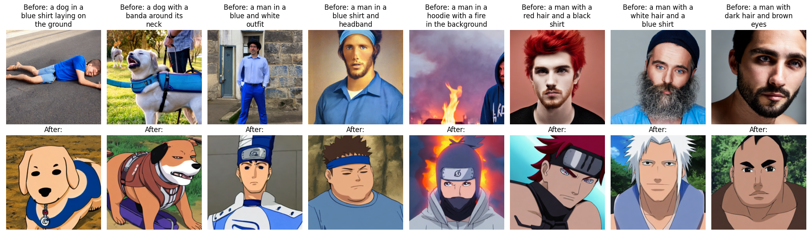
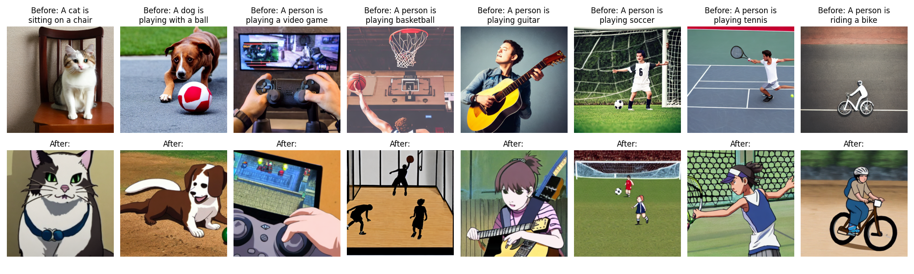

# finetune Stable diffusion on naruto dataset

### Setup
In this project we use stable-diffusion v1.4 as our base model.
For dataset, We use naruto dataset captioned with blip from huggingface datasets (lambdalabs/naruto-blip-captions), which has around 1k images.

### code detail
Here we explain the core function of trainning（line 947-1080）：
1. Latent Encoding, convert image from pixel space to latent space
2. text embedding encode for condition, encode text using clip
3. Noise Generation and Timestep Sampling
4. Noise Addition (Forward Diffusion Process)
5. Noise Prediction(unet forward) 
6. Loss Computation(SD 1.4 is noise prediction)

### training hyperparameters
We train model with 15000 steps with learningg rate 1e-5, 512 resolution, on 1 A100 GPU, the batch size is 2 and with gradient_accumulation_steps 2 the logical batch size is 4. It takes 2 hour to finish the train.

## sample results
We sample both before and after fine-tuning the model with indomain(prompts in the train data) out domain(prompts in common case), to compare the style difference.

Compare of in domain cases:

Compare of out domain cases:

We could notice that the model successfully transfer the style domain and still retaining the model’s original semantic understanding capabilities, nice work!